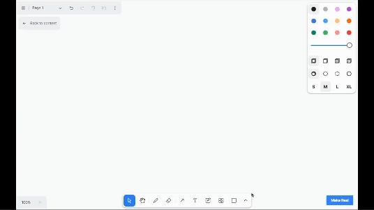

# draw-a-flutter-ui

An app based on draw-a-ui modified to generate Dart and Flutter code. The code is generated with the GPT-4 Vision API based on a wireframe you draw and displayed with Dartpad.



Works by taking the current canvas SVG, converting it to a PNG and sending that PNG to GPT-4 Vision with instructions to return Flutter code.

## Getting Started

To get started run the following commands in the root directory of the project. You will need an OpenAI API key with access to the GPT-4 Vision API.

> Note this uses Next.js 14 and requires a version of `node` greater than 18.17. [Read more here](https://nextjs.org/docs/pages/building-your-application/upgrading/version-14).

```bash
echo OPENAI_API_KEY=sk-your-key > .env.local
npm install
npm run dev
```

Open [http://localhost:3000](http://localhost:3000) with your browser to see the result.
